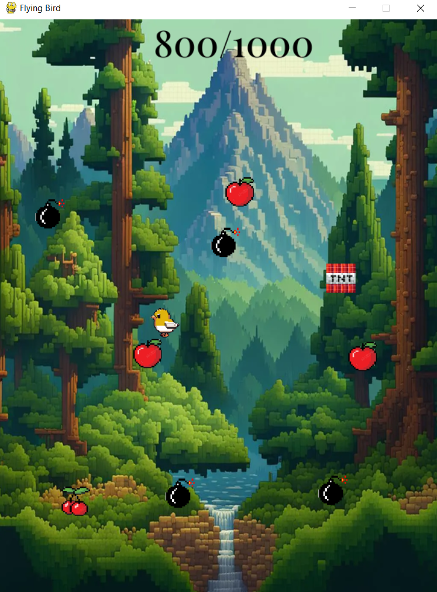

# JumpingBird

## Screenshots

*Start page*


*Level*

## Requirements
To run this game, you need to have Python and Pygame installed on your system.
- You can download Python from the official documentation: [Python Downloads](https://www.python.org/downloads/)
- After installing Python, you can install Pygame by typing the following command in the command line:

```
pip install pygame
```

- Once installed, you can verify the versions of Python and Pygame by typing the following commands:

```
python --version
pygame --version
```

Make sure both Python and Pygame are installed and their versions are displayed.

## Installation
To play the game, you need to clone this repository from GitHub. You can do this by running the following command:

```
git clone https://github.com/Mateusz-best-creator/JumpingBird.git
```

## Getting a Single Executable
To obtain a single executable file (like `main.exe`), you need to execute the following commands:

If you do not have `pyinstaller` installed, you can install it using:
```
pip install pyinstaller
```

Then, you can create the executable by running:
```
pyinstaller main.py
```

## How to Play
- Use the arrow keys to navigate through the start page.
- Press the space bar to jump while playing.
- Use the left and right arrow keys to move your character.

Try to gather as many fruits as you can and avoid bombs and TNTs! Aim to progress through all three levels, each with different thresholds (the number of points required to win).
Good luck and have fun!
